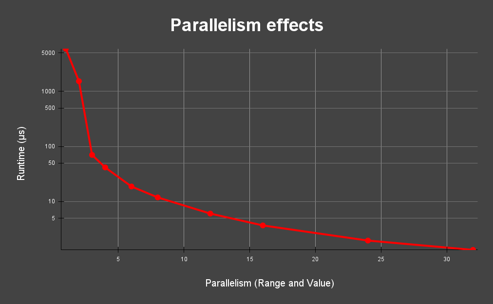

# Advent of FPGA

This is an FPGA based solution to Day 5 Part 1 (Cafeteria) of Advent of Code. The problem can be found here: [link](https://adventofcode.com/2025/day/5)

My solution targets the KV260 board, as it is more realistic than something huge like a Versal chip, and the KV260 is also the prize of the competition!

## License

This library is available under the CERN Open Hardware Licence Version 2 - Strongly Reciprocal.

## Build instructions

1. Run preprocessing.py; it has three arguments {<input_file_name.txt>, <range_parallelism>, <value_parallelism>}
      The most basic case would be "python3 preprocessing.py input.txt 1 1"
  
2. Run your preferred simulation or synthesis. The files that need to be compiled are simply all .sv files in the hardware directory. Note that a ModelSim macro file is included that can be executed by running "do run_sim.do" in the ModelSim terminal.

## Introduction

In the problem, you are given an input file with a set of numerical ranges, and a set of values. The question is "How many values fall within at least one of the ranges?"

Values look like: 2073458932

Ranges look like: 2073458932-98267249087

The ranges are inclusive, and so in this case, the value would indeed fall within the range. If this was the entire contents of the input file, the answer would be 1, since exactly 1 of the values fell within at least one of the ranges.

## Approach

The usual approach to solving this problem in software involves sorting the ranges and/or values. However, sorting is very challenging to do well on an FPGA due to hardware constraints and the sequential nature of the process. In light of this, it makes sense to first consider the most basic approach possible.

If we assume we have access to all of the ranges and values, the most basic approach involves starting with the very first value, and iterating through the ranges until we find a match, or exhaust our options. We then repeat this process with the next value, and the next, until we have checked all of the values.

This approach is much more easily implementable on an FPGA. It takes up very little area, and doesn't use much power. However, it's extremely slow. On a 100Mhz clock, it takes 1.39ms! That's slower than a lot of the sorting-based software solutions, which can take 35-50μs. 

How could we improve this?

Since we have used so little of the FPGA's area (0.09%), we could fit much more circuitry, if it caused an increase in performance. The most obvious performance gain would be to parallelize the computation, which is very natural for this problem. Every single check of any value within any range is completely independent of any other check. This means that if we could hypothetically check all of the values at the same time, and each value was being checked against all of the ranges, we could get the result after just one clock cycle! However, this approach would take up enough area to fill over 100 of the FPGAs we are trying to target.

Clearly, there is a middle-ground that we want to find in the tradeoff of Area vs. Performance, but that sweet spot is different for each FPGA. If we wanted this solution to be flexible, how could we make it work extremely well on any FPGA?

## Implementation

The implementation is largely based around the usage of on-chip memory to hold the input data. On-chip memory can be initialized during programming, and all the stored data will then be available when computation begins. Counters (representing the memory address) are used to "walk" through each of the memory files in order to check all of the values and ranges. If we have a memory file for the low range bounds, the high range bounds, and the values, the implementation of a range check is two comparators used to evaluate the expression:

if (value >= low_bound && value <= high_bound) then: match OR  
"if the value is greater than or equal to the lower bound, and less than or equal to the higher bound, it is a match"

Accumulating the result of this expression over the course of the computation will yield the count of the number of values that fall within at least one range. However, what if we want to incorporate our idea of parametrizing the parallelism? (try and say that one 10 times fast)

As the parallelism increases, we want a larger number of smaller memory banks, each with individual checkers and hardware. The parallelism parameters essentially split the entire set into N equally sized chunks, where N is the actual parameter value inputted. To acheive this, we must rise above the constraints of SystemVerilog to the high-level language of python. The python script preprocessing.py generates the parameters package and the memory initialization files based on the input file and the chosen parallelism values. After the python pre-processing, the SystemVerilog design is able to tile the hardware based on the generated file params_pkg.sv.

## Results

Now that we have a design we can easily tile by running a short script, what do the ideal parameters for parallelizing the design actually look like? One idea would be to start with range_parallelism = 1 and value_parallelism = 1, then increase until we exceed the area available on the FPGA. This approach produces the following graph:

